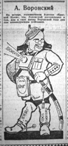
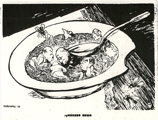

# Other Images
## Cartoons and Drawings about Voronsky's Life

Click on the titles for larger images.

|  | [&quot;Ecce homo.&quot; Cartoon drawn by Deni depicting Voronsky on cross, under attack by arrows labelled with the names: Tarasov-Rodionov, Rodov, Lelevich and Volin. 1923.](Pages/CartoonAKV23.html) |
|  | [&quot;Plenary Session of Russian Literature.&quot; Cartoon drawn by Boris Efimov in 1923. Published in &quot;Prozhektor,&quot; No. 10, 31 May 1924. Voronsky at center of table, before an issue of &quot;Krasnaia nov,&quot; with his arms encircling writers from &quot;Krug&quot;.](Pages/CartoonEfimov23.html) |
|  | [Voronsky as drawn by Deni for cover of pamphlet, &quot;On Art,&quot; 1925.](Pages/CartoonDeni25.html) |
|  | [Cartoon drawn by Kukryniksy, &quot;Pushkin in the Images of 1927,&quot; NLP, 1927, 5 February, # 3, p. 74. Voronsky as the cat chained to the oak tree.](Pages/CartoonKuk27.html) |
|  | [Cartoon by N. Gatilov, &quot;A. K. Voronsky,&quot; Vecherniaia Moskva, 1927, 26 February, #47 (958), p. 3. Voronsky in military uniform.](Pages/CartoonGatilov27.html) |
|  | [Cartoon drawn by Kukryniksi, suggesting that Polonsky's literary views had always been a shadow of the opinions held by Voronsky and Trotsky. &quot;Na literaturnom postu,&quot;](Pages/CartoonKukryniksy28.html) |
|  | [Cartoon of Voronsky in barrel labeled &quot;Izd-vo Krug&quot; [Circle Publishing House], by P. Lebedev in &quot;Chitatel' i pisatel', 1928, &#x2116; 19 (May 12), page 9.](Pages/CartoonLebedev28.html) |
|  | [&quot;Humane kasha.&quot; Cartoon of Voronsky, Gorbov, Lezhnev and other Perevalists, drawn by Kukryniksy, &quot;Na literaturnom postu,&quot; 1930, # 5-6, p.123.](Pages/CartoonKuk30.html) |
|  | [&quot;General of Shattered Armies,&quot; (Poem by A. Arkhangelsky, cartoon by Kukryniksy), Na literaturnom postu, 1931, #1, p. 12.](Pages/CartoonKuk31.html) |
|  | [&quot;Voronsky - Fiction Writer,&quot; (Poem by Alarikus, cartoon by Kukryniksy), Na literaturnom postu, 1931, #15, p. 43.](Pages/CartoonKuk31_15.html) |

\| [Photographs](Photos.html) \| [More Photographs](Photos2.html) \|
