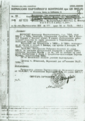
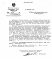

# Documents
## Introduction

The documents presented here come from the personal archives of the Voronsky family and from
official state archives of the former Soviet Union. Whenever possible, we give a scanned image
of the document, a translation of its contents, and comments on the significance of the
information provided. Most of the documents were collected during the period of 1991-1995,
when access to material in archives in Russia was at times difficult or non-existent.
As in other sections of this web site, we welcome any additional material that readers may provide.

Click on a document for a larger image.
<table>
	<tr>
		<td>
			
		</td>
		<td>Postcard from Voronsky, in Kem', to his mother on February 16, 1913, noting that he had no reliable news about the Tsar's amnesty (to celebrate 300 years of the Romanov dynasty), but that he didn't expect full clemency, just a possible shortening of his sentence.</td>
    </tr>
	<tr>
        <td>
                
                
        </td>
        <td>
            Two-page handwritten letter from Voronsky to Sergo Ordzhonikidze, 3 March 1927,
            concerning the February 1927 meeting to celebrate the fifth anniversary of the
            journal &quot;Krasnaia nov'&quot; [Red Virgin Soil].
        </td>
    </tr>	
    <tr>
        <td></td>
        <td>
            Article from Pravda, 24 January 1929, announcing the arrest of 150 people
            &quot;for anti-Soviet activity,&quot; including Mdivani, Pankratov, Globus,
            Drobnis, Kavtaradze, Voronsky, Gaevsky, and Grinshtein.
        </td>
    </tr>
    <tr>
        <td>
                
                
        </td>
        <td>Letter from Voronsky to the Special Board of the OGPU, 7 September 1929, requesting permission to travel from exile in Lipetsk to Moscow for medical treatment.
            
Handwritten letter and typescript.

        </td>
    </tr>
    <tr>
        <td>
                
        </td>
        <td>
            Handwritten the letter from Voronsky to the Central Control Commission of the VKP(b), 11 November 1929,
            declaring that he is leaving the Opposition. He condemns Trotsky's activity,
            especially his activity abroad, and ends by asking to be accepted into the ranks
            of the Communist Party.
        </td>
    </tr>
    <tr>
        <td>
                
        </td>
        <td>
            Document from the Party Control Commission, 7 August 1936. Provides an excerpt
            from the minutes of a meeting of the Party Control Commission on 13 March 1936,
            confirming the decision of the October Regional Committee to expel Voronsky from
            the Party on 15 March 1935. It is noted that Voronsky gave an explanation on
            16 November 1935. He was accused of giving support to the exiled writer, Mirov,
            in 1931, of not reporting this aid to the Party, and of maintaining ties with
            Sergei Zorin, a supporter of Trotsky and Zinoviev arrested by the NKVD.
        </td>
    </tr>
    <tr>
        <td>
                
        </td>
        <td>
            Stalin's signature on list of people subject to trial by the Military Collegium
            of the Supreme Court, 10 August 1937. Voronsky appears as number 12 on the next page.
        </td>
    </tr>
    <tr>
        <td>
            
        </td>
        <td>
            Letter from the Military Collegium of the Supreme Court of the USSR on 27 March 1989
            informing Voronsky's granddaughter that Voronsky had been sentenced to death on
            August 13, 1937, and probably shot on the same day.
        </td>
    </tr>
</table>
