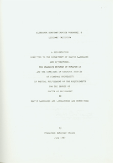
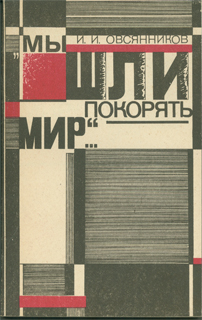
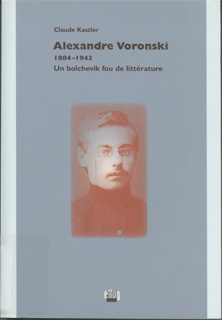
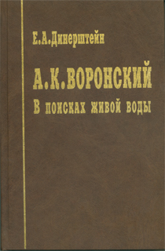

# Books and Dissertations About Voronsky

<table>
    <thead>
        <tr>
            <th style="width: 220px">Cover</th>
            <th>Description</th>
        </tr>
    </thead>
    <tbody>
        <tr>
            <td></td>
            <td>
                <strong>Author:</strong>Gabriela Por&#x0119;bina.
                
<strong>Title</strong>: Aleksander Woro&#x0144;ski. Poglady Estetyczne i Krytycznoliterackie (1921-1928).

                
<strong>Where Published</strong>: Wroc&#x0142;aw - Warszawa-Krakow,&nbsp;Zak&#x0142;ad Narodowy im. Ossoli&#x0144;skich.

                
<strong>Year</strong>: 1964.

                
<strong>Pages</strong>: 147

            </td>
        </tr>
        <tr>
            <td></td>
            <td>
                <strong>Author: </strong>Robert A. Maguire
                
<strong>Title</strong>: Red Virgin Soil: Soviet Literature in the 1920s.

                
<strong>Where Published</strong>: Princeton University Press.

                
<strong>Year</strong>: 1968.

                
<strong>Pages</strong>: 482.

            </td>
            </tr>
        <tr>
            <td></td>
            <td>
                <strong>Author: </strong>&#x041F; <strong>. </strong>&#x0412;. &#x041A;&#x0443;&#x043F;&#x0440;&#x0438;&#x044F;&#x043D;&#x043E;&#x0432;&#x0441;&#x043A;&#x0438;&#x0439; [P. V. Kupriianovskii]
                
<strong>Title</strong>: &#x0410;. &#x041A;. &#x0412;&#x043E;&#x0440;&#x043E;&#x043D;&#x0441;&#x043A;&#x0438;&#x0439; &#x0432; &#x0418;&#x0432;&#x0430;&#x043D;&#x043E;&#x0432;&#x043E;-&#x0412;&#x043E;&#x0437;&#x043D;&#x0435;&#x0441;&#x0435;&#x043D;&#x0441;&#x043A;&#x043E;&#x0439; &#x043F;&#x0435;&#x0447;&#x0430;&#x0442;&#x0438; (1918-1926). &#x0411;&#x0438;&#x0431;&#x043B;&#x0438;&#x043E;&#x0433;&#x0440;&#x0430;&#x0444;&#x0438;&#x0447;&#x0435;&#x0441;&#x043A;&#x0438;&#x0439; &#x0443;&#x043A;&#x0430;&#x0437;&#x0430;&#x0442;&#x0435;&#x043B;&#x044C;. [A. K. Voronskii in the Ivanovo-Voznesensk Press (1918-1926)]

                
<strong>Publisher</strong>: &#x0418;&#x0432;&#x0430;&#x043D;&#x043E;&#x0432;&#x043E;: &#x0418;&#x0432;&#x0430;&#x043D;&#x043E;&#x0432;&#x0441;&#x043A;&#x0438;&#x0439; &#x0413;&#x043E;&#x0441;. &#x0423;&#x043D;&#x0438;&#x0432;&#x0435;&#x0440;&#x0441;&#x0438;&#x0442;&#x0435;&#x0442;

                
<strong>Year</strong>: 1979

                
<strong>Tirazh</strong>: 200

                
<strong>Pages</strong>: 24

            </td>
        </tr>
        <tr>
            <td></td>
            <td>
                <strong>Author: </strong>&#x0412;. &#x0418;. &#x0412;&#x043E;&#x0440;&#x043E;&#x0431;&#x0447;&#x0435;&#x043D;&#x043A;&#x043E; [V. I. Vorobchenko]
                
<strong>Title</strong>: &#x041F;&#x0443;&#x0431;&#x043B;&#x0438;&#x0446;&#x0438;&#x0441;&#x0442;-&#x041B;&#x0435;&#x043D;&#x0438;&#x043D;&#x0435;&#x0446;. &#x0420;&#x0435;&#x0432;&#x043E;&#x043B;&#x044E;&#x0446;&#x0438;&#x043E;&#x043D;&#x043D;&#x043E;-&#x043F;&#x0443;&#x0431;&#x043B;&#x0438;&#x0446;&#x0438;&#x0441;&#x0442;&#x0438;&#x0447;&#x0435;&#x0441;&#x043A;&#x0430;&#x044F; &#x0434;&#x0435;&#x044F;&#x0442;&#x0435;&#x043B;&#x044C;&#x043D;&#x043E;&#x0441;&#x0442;&#x044C; &#x0410;. &#x041A;. &#x0412;&#x043E;&#x0440;&#x043E;&#x043D;&#x0441;&#x043A;&#x043E;&#x0433;&#x043E; (1911-1918 &#x0433;&#x0433;.) [Publicist-Leninist. The Revolutionary-Publicistic Activity of A. K. Voronsky (1911-1918)]

                
<strong>Publisher</strong>: &#x041A;&#x0438;&#x0448;&#x0438;&#x043D;&#x0435;&#x0432; &laquo;&#x0428;&#x0442;&#x0438;&#x0438;&#x043D;&#x0446;&#x0430;&raquo;

                
<strong>Year</strong>: 1986

                
<strong>Tirazh</strong>: 1075

                
<strong>Pages</strong>: 159

            </td>
        </tr>
        <tr>
            <td></td>
            <td>
                <strong>Author: </strong>Frederick S. Choate
                
<strong>Dissertation Title</strong>: Aleksandr Konstantinovich Voronskii's Literary Criticism.

                
<strong>Where Published</strong>: Stanford University.

                
<strong>Year</strong>: 1987.

                
<strong>Pages</strong>: 362.

            </td>
        </tr>
        <tr>
            <td></td>
            <td>
                <strong>Author</strong>: &#x0418;. &#x0418;. &#x041E;&#x0432;&#x0441;&#x044F;&#x043D;&#x043D;&#x0438;&#x043A;&#x043E;&#x0432; [Ivan I. Ovsiannikov]
                
<strong>Title</strong>: &laquo;&#x041C;&#x044B; &#x0448;&#x043B;&#x0438; &#x043F;&#x043E;&#x043A;&#x043E;&#x0440;&#x044F;&#x0442;&#x044C; &#x043C;&#x0438;&#x0440;...&raquo;. &#x0414;&#x043E;&#x043A;&#x0443;&#x043C;&#x0435;&#x043D;&#x0442;&#x0430;&#x043B;&#x044C;&#x043D;&#x0430;&#x044F; &#x043F;&#x043E;&#x0432;&#x0435;&#x0441;&#x0442;&#x044C; &#x043E;&#x0431; &#x0410;&#x043B;&#x0435;&#x043A;&#x0441;&#x0430;&#x043D;&#x0434;&#x0440;&#x0435; &#x0412;&#x043E;&#x0440;&#x043E;&#x043D;&#x0441;&#x043A;&#x043E;&#x043C;. [&quot;We came to pacify the world...&quot; A Documentary Novella About Alexander Voronsky]

                
<strong>Publisher</strong>: Voronezh.

                
<strong>Year</strong>: 1992

                
<strong>Tirazh</strong>: 5000

                
<strong>Pages</strong>: 215

            </td>
        </tr>
        <tr>
            <td></td>
            <td>
                <strong>Author: </strong>Robert Vaagan
                
<strong>Dissertation Title</strong>: Iskusstvo videt' prekrasnoe. The Literary Aesthetics of Aleksandr Voronskij 1921-1928

                
<strong>Where Published</strong>: University of Oslo.

                
<strong>Year</strong>: 1999.

                
<strong>Pages</strong>: 440.

            </td>
        </tr>
        <tr>
            <td></td>
            <td>
                <strong>Author: </strong>Claude Kastler
                
<strong>Title</strong>: Alexandre Voronski. 1884-1943. Un bolchevik fou de litterature.

                
<strong>Publisher</strong>: Ellug, Universite Stendahl, Grenoble.

                
<strong>Year</strong>: 2000.

                
<strong>Pages</strong>: 183.

            </td>
        </tr>
        <tr>
            <td></td>
            <td>
                <strong>Author: Efim A. Dinershtein</strong>
                
<strong>Title: </strong>&#x0410;. &#x041A;. &#x0412;&#x043E;&#x0440;&#x043E;&#x043D;&#x0441;&#x043A;&#x0438;&#x0439;. &#x0412; &#x043F;&#x043E;&#x0438;&#x0441;&#x043A;&#x0430;&#x0445; &#x0436;&#x0438;&#x0432;&#x043E;&#x0439; &#x0432;&#x043E;&#x0434;&#x044B;. [A. K. Voronskii. In Search of Living Water]

                
<strong>Publisher</strong>: Moscow: ROSSPEN.

                
<strong>Year</strong>: 2001.

                
<strong>Tirazh</strong>: 2000.

                
<strong>Pages</strong>: 360.

            </td>
            <td></td>
        </tr>
    </tbody>
</table>

