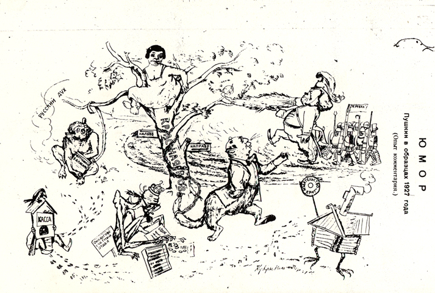

#Cartoon by Kukryniksy, 1927

Cartoon drawn by Kukryniksy, &quot;Pushkin in the Images of 1927,&quot; NLP, 1927, 5 February, # 3, p. 74. Voronsky as a learned cat chained to the &quot;Krasnaia nov&quot; oak tree.