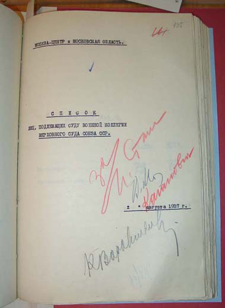

# Document
## List of People Subject to Trial by the Military Collegium of the Supreme Court of the USSR, 10 August 1937

**Description**: &quot;List of People Subject to Trial by the Military Collegium of the Supreme
Court of the USSR,&quot; containing 81 names from the &quot;Moscow Center and Moscow Area. &quot;
The signatures approving the list are those of Stalin, Molotov, Kaganovich, and Voroshilov.
Voronsky appears as number 12 on the [next page](AKV_List_pg02197.html).

**Translation**: Scrawled across the page in red pencil is:
&quot;For -- I. Stalin, V. M. [Viacheslav Molotov], Kaganovich, and K. Voroshilov.&quot;

**Comment**: Stalin and his cohorts surveyed these many lists, occasionallly crossing off
names and adding comments such as &quot;hold for now.&quot; Voronsky appeared on this list
on 10 August 1937. His trial and execution were held on 13 August.