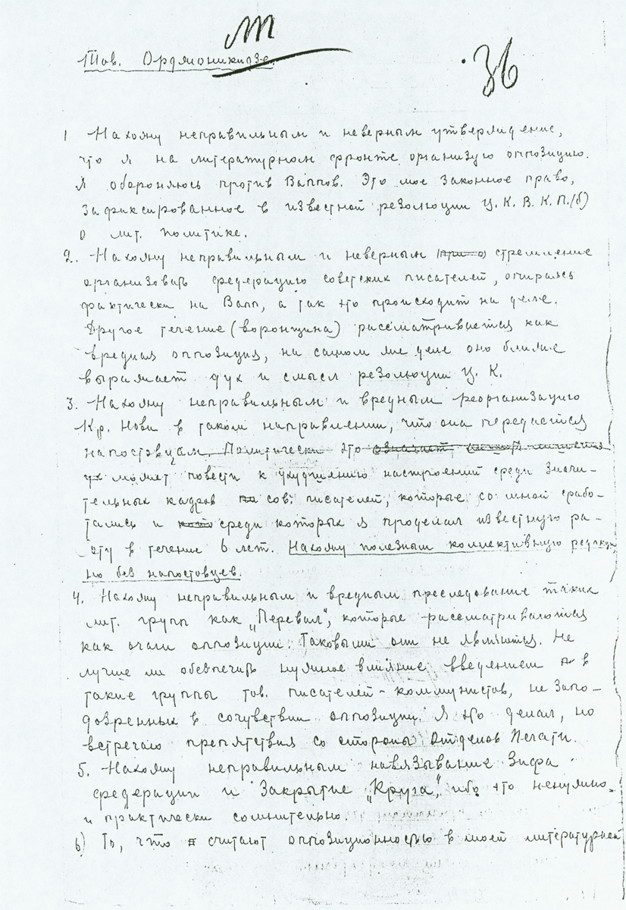

# Document
## Handwritten Letter from Voronsky to Ordzhonikidze, 3 March 1927, First Page

**Description**: Handwritten letter from Voronsky to Sergo Ordzhonikidze, 3 March 1927.
Voronsky raises several issues concerning the fifth anniversary celebration of the journal
which he edited, &quot;Krasnaia nov'&quot; [Red Virgin Soil].

