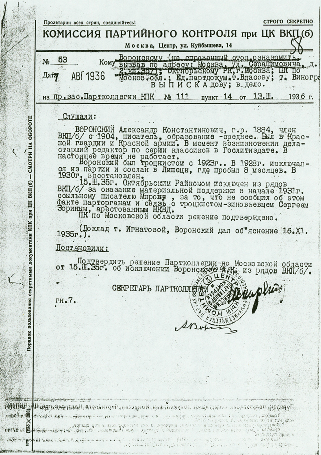

# Document

## Report by the Party Control Commission, 7 August 1936

**Description**: Document from the Party Control Commission, 7 August 1936. Provides an excerpt from the minutes of a
meeting of the Party Control Commission on 13 March 1936, confirming the decision of the October Regional Committee to
expell Voronsky from the Party on 15 March 1935. It is noted that Voronsky gave an explanation on 16 November 1935. He
was accused of lending support to the exiled writer, Mirov, in 1931, of not reporting this aid to the Party, and of
maintaining ties with Sergei Zorin, a supporter of Trotsky and Zinoviev arrested by the NKVD.

**Translation**:

	Excerpt from the minutes of session No. 111 of the Party Control Commission on 13 March 1935

## HEARD:

VORONSKII Aleksandr Konstantinovich, born 1884, member of the VKP(b) since 1904, writer,
of mid-level education. Was in the Red Guard and the Red Army. When the case was opened,
senior editor of the classics at Goslitizdat. At the present time, not working.

Voronskii was a Trotskyist from 1923. In 1928 expelled from the Party and exiled to Lipetsk,
where he spent eight months. In 1930, restored to Party membership.

On 15 March 1935, expelled from the ranks of the VKP(b) by the October Regional Committee for
giving material support at the beginning of 1931 to the exiled writer Mirov, for not informing
the Party organs about this support, and for ties with Sergei Zorin, a supporter of Trotsky
and Zinoviev who has been arrested by the NKVD.

The resolution is confirmed by the Party Control of the Moscow area.

(Report by Comrade Ignatova, Voronskii gave an explanation on 16 November 1935).

## DECREED:

To confirm the resolution of the Party Collegium of the Moscow area on 15 March 1935 to
expell Voronskii A. K. from the ranks of the VKP(b).

Secretary of the Party Collegium [Shkiriatov?]

[signed by A. Voronskii]

  

**Comment**:

It is noted that Voronsky was shown the document, which is confirmed by his 
ignature. In August 1936, preparation for the first major frame-up trial was well underway.
It is not inconceivable that Voronsky was being considered as a defendant; Ter-Vaganian,
for instance, was added at the last minute. Voronsky would be arrested on February 1, 1937.

