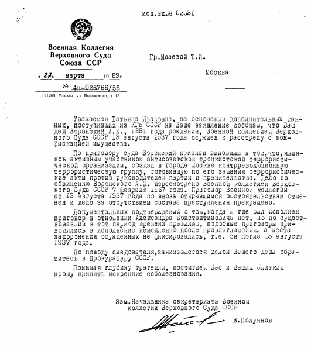

# Document
## Letter from Military Collegium of the Supreme Court of the USSR, 27 March 1989

**Description**: Letter from the Military Collegium of the Supreme Court of the USSR on
27 March 1989, informing Voronsky's granddaughter that Voronsky had been sentenced to death
on August 13, 1937, and probably shot on the same day.

