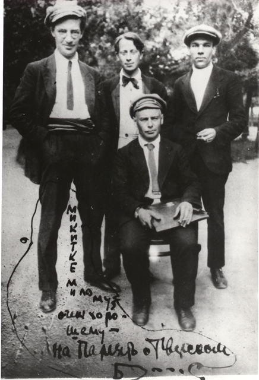

# Voronsky and Writers, 1920s

Voronsky, seated, with Pilniak standing on left; Nikolai Nikitin is probably in the middle. 1920s.

The inscription reads: "To Mikitka, dear and very good -- in memory of Tverskoi Boulevard."

