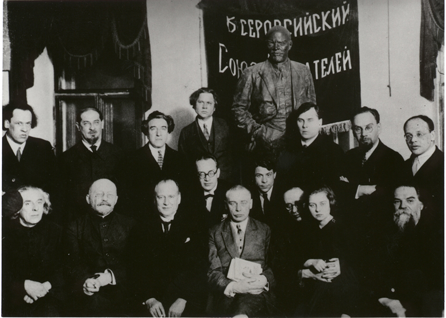

# Group Photo, Herzen House, 21 February 1927

Meeting in Moscow on 21 February 1927 at the Herzen House. In commemoration of the journal, "Red Virign Soil."

People seated (from left to right): Georgii Chulkov, Vikentii Veresaev, Khristian Rakovsky, Boris Pilniak, Aleksandr Voronsky, Petr Oreshin, Karl Radek (holding Galina A. Voronskaya), Pavel Sakulin.

People standing (from left to right: Ivan Yevdokimov, V. Lvov-Rogachevsky, Viacheslav Polonsky, Fedor Gladkov, Mikhail Gerasimov, A. Efros, Isaak Babel.

