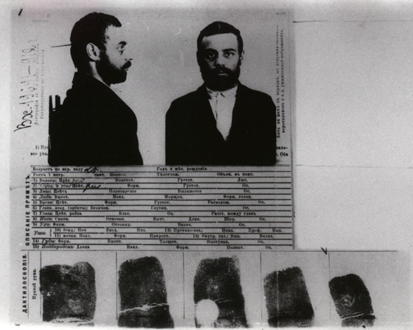

# Tsarist Police Photograph of Voronsky, ca. 1912

Photograph and fingerprints of Voronsky taken by the Tsarist police, after one of his early arrests (1906, 1907, 1912). From archives at the Odessa Literary Museum.