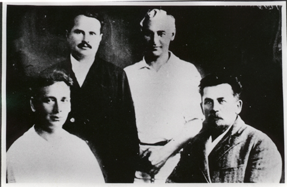

<---
layout: home
section: akv
---

# Group Photo, 1926

Meeting of former members of "Senia Markov's Commune" [Petersburg, 1905-6] at the "Red Rocks" sanatorium in Kislovodsk in the summer(?) of 1926. All were members of the Bolshevik Party assigned to the Putilov works before their arrest in September 1906.

From Left to Right: M. V. Bogdanov, S. V. Markov, A. K. Voronsky, A. M. Buiko.
