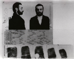
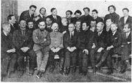
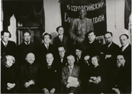
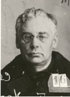
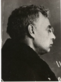
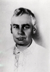
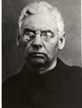

# Photographs
## Photos from Voronsky's Life

Click on the titles for larger images.

|  | [AKV as student, 1904](Pages/Photo_AKVstudent1904.html) |
|  | [Faculty at Tambov Seminary from which Voronsky was expelled in 1905](Pages/Photo_Faculty1905.html) |
|  | [Exiles in Yarensk, ca. 1908. Voronsky is sitting at right, next to his future wife, Serafima Pesina](Pages/Photo_Yarensk1908.html) |
|  | [Mug shot and fingerprints taken by Tsarist Secret Police. Date unknown &#40;ca.1912&#41;.](Pages/Photo_Mugshot1912.html) |
|  | [Photo from Tsarist Secret Police files, ca. 1912](Pages/Photo_Okhrana12.html) |
|  | [Group of exiles in Kem, Arkhangelsk Province, ca. 1912. Voronsky is seated, second from left](Pages/Photo_Kem12.html) |
|  | [Voronsky, ca. 1917-1919.](Pages/Photo_AKV1918.html) |
|  | [Voronsky among Ivanovo delegates to the VIIIth All-Russian Congress of Soviets, Moscow, 1920](Pages/Photo_Delegates.html) |
|  | [Voronsky &#40;seated&#41; with Pilniak, standing left. One of other two figures is probably Nikitin. Early 1920s](Pages/Photo_AKVgroup1920s.html) |
|  | [Voronsky as member of leadership of the All-Russian Union of Writers, February 1925.](Pages/Photo_VSP1925.html) |
|  | [Funeral Commission for M. V. Frunze. 1925. Third from left: Avel Yenukidze; fourth from left: Voronsky.](Pages/Photo_FrunzeFuneralCom1925.html) |
|  | [Voronsky at XIVth Congress of the RCP, December 1925.](Pages/Photo_XIVCongress.html) |
|  | [Voronsky at reunion with three other Bolsheviks previously assigned to the Putilov works. Kislovodsk, 1926.](Pages/Photo_Putilovtsy.html) |
|  | [Taken at Jubilee celebrating Krasnaia nov. Herzen House, February 1927.](Pages/Photo_KN1927.html) |
|  | [Voronsky in the summer or fall of 1927. From: &quot;Vlast' sovetov za 10 let,&quot; Leningrad, 1927, p. 173.](Pages/Photo_AKV1927.html) |
|   | Photos [A](Pages/Photo_AKVarrest1929a.html) and [B](Pages/Photo_AKVarrest1929b.html) taken at the time of Voronsky's arrest by the OGPU in January 1929. |
|  | [Voronsky in exile in Lipetsk, September 1929.](Pages/Photo_Lipetsk1929.html) |
|   | Photos [A](Pages/Photo_AKVarrest1937a.html) and [B](Pages/Photo_AKVarrest1937b.html) taken after arrest by the NKVD on February 1, 1937. Last known photos of Voronsky. |

\| [More Photographs](Photos2.html) \| [Other Images](Cartoons.html) \|