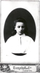
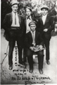
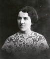

# Photographs
## More Photographs Related to Voronsky's Life

Click on the titles for larger images.

|  | [Voronsky's parents, Konstantin Osipovich and Feodosiia Gavrilovna.](Pages/Photo_Parents.html) |
|  | [Voronsky's sister, Larisa.](Pages/Photo_Sister.html) |
|  | [House where Voronsky lived in Dobrinka from 1889-1900](Pages/Photo_Dobrinka.html) |
|  | [Voronsky's mother, Feodosiia Gavrilovna.](Pages/Photo_Mother.html) |
|  | [Building in Ivanovo where Voronsky and other Bolsheviks lived 1918-1920.](Pages/Photo_Ivanovo.html) |
|  | [Voronsky (seated) with Pilniak, standing left. One of other two figures is probably Nikitin. Early 1920s.](Pages/Photo_AKVgroup1920s.html) |
|  | [Voronsky's wife, Serafima Solomonovna Pesina, 1920s](Pages/Photo_Wife.html) |
|  | [On right: &quot;House on the Embankment,&quot; where Voronsky lived from 1931 until his arrest here on February 1, 1937](Pages/Photo_DomNaNab.html) |
|  | [Group photo, Gorky Institute of World Literature, Moscow, December1984. Commemorating 100 years since Voronsky's birth.](Pages/Photo_group.html) |

\| [Photographs](Photos.html) \| [Other Images](Cartoons.html) \|
