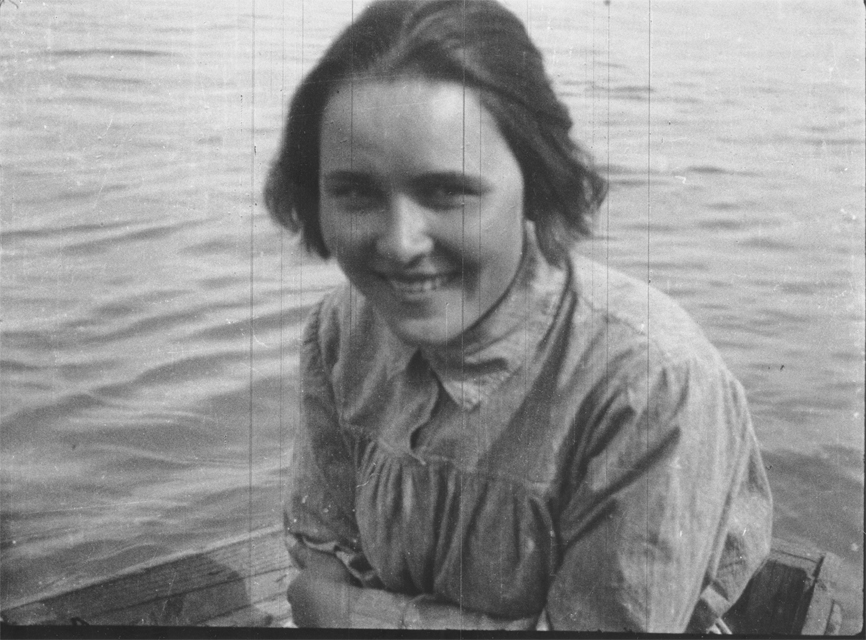

# Shura Alekseeva at Sochi, 1926

&quot;Shura&quot; Alekseeva, Vaganian's first wife, in Sochi, 1926. She was an Old Bolshevik who wrote a book called
&quot;&#x0411;&#x0440;&#x044B;&#x0437;&#x0433;&#x0438;&quot; in the 1920s. She left Vaganian and married V. I. Polonsky.
She was arrested in 1936 or 1937, and apparently died under extremely brutal torture.