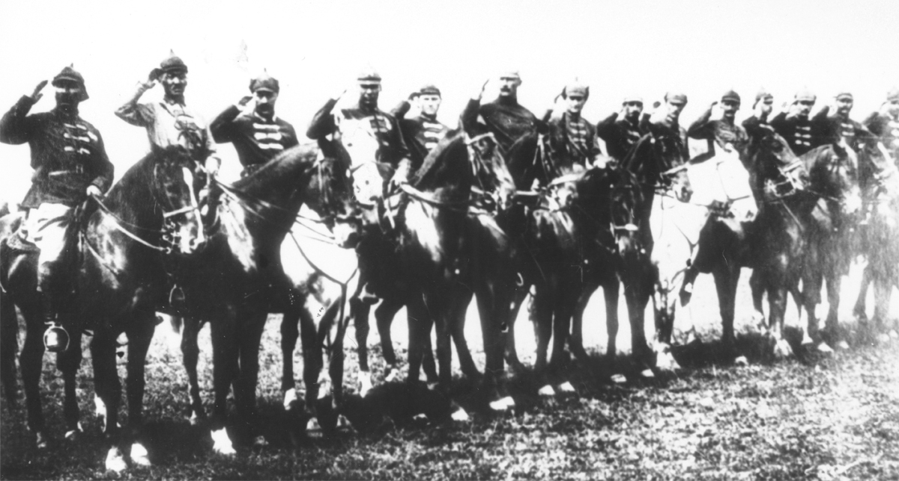

# First Cavalry Army, 1920

1919-1920: Commanding Staff of the First Cavalry Army. S. M. Budenny, O. I. Gorodovikov, Shchelokov, S. K. Timoshenko,
A. V. Khrulev, Rakitin, Ter-Vaganian, S. K. Minin and others.

From the Russian State Archive of Film and Photodocuments.