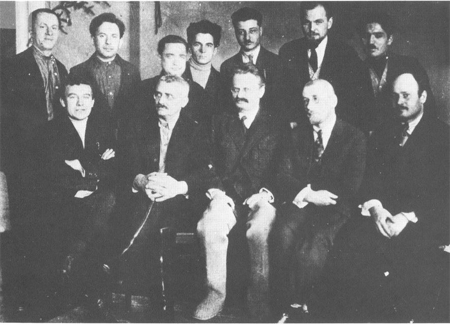

# Group of Left Oppositionists in Moscow, 1927

Group of Left Oppositionists in Moscow in 1927. Bottom row, left to right: Istchenko, I. Smirnov, Trotsky, I. Smilga,
Alsky. Top row, second from left: Man-Nevelson, husband of Nina Bronstein, Trotsky's daughter; last on right: Ter-Vaganian.