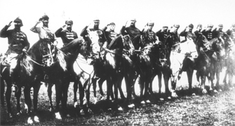
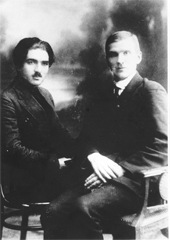
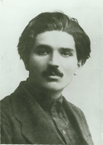
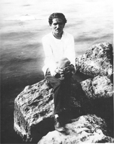
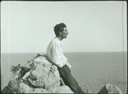
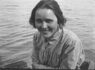
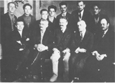
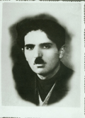
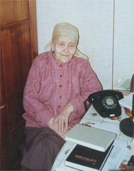
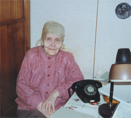

# Photographs
## Photos from Ter-Vaganian's Life

|  | According to the Russian State Archive of Film and Photodocuments, Ter-Vaganian is the seventh figure from the left in this photo of the Commanding Staff of the First Cavalry Army, ca. 1919-1920. | [Larger image](Pages/Photo_Konarmiia1920.html) |
|  | Vaganian and Yakovlev, ca. 1920. | [Larger image](Pages/Photo_Vaganian_Yakovlev1920.html) |
|  | Ter-Vaganian, ca. 1925. | [Larger image](Pages/Photo_Vaganian1925.html) |
|  | Ter-Vaganian at Sochi, on the Black Sea, 1926. From a film taken at the time. | [Larger image](Pages/Photo_Vaganian1926_2.html) |
|  | Ter-Vaganian, at Sochi, on the Black Sea, 1926. From a film taken at the time. | [Larger image](Pages/Photo_Vaganian1926.html) |
|  | &quot;Shura&quot; Alekseeva, Vaganian's first wife, in Sochi, 1926. Arrested in 1936 or 1937, and apparently died under extremely brutal torture. | [Larger image](Pages/Photo_Alekseeva1926.html) |
|  | Ter-Vaganian among a group of Left Oppositionists in Moscow in 1927. | [Larger image](Pages/Photo_Oppositionists1927.html) |
|  | Ter-Vaganian at the time of his wedding to his second wife, Klavdiia Generalova, in 1928. | [Larger image](Pages/Photo_Vaganian1928.html) |
|  | Ter-Vaganian's widow, Klavdiia Generalova, in Moscow in 1993. | [Larger image](Pages/Generalova1.html) |
|  | Ter-Vaganian's widow, Klavdiia Generalova, in Moscow in 1993. | [Larger image](Pages/Generalova2.html) |
