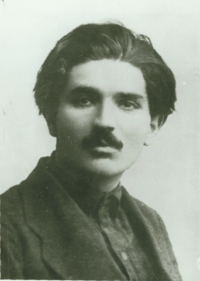

# Vagarshak Arutiunovich Ter-Vaganian (1893-1936)

   

Ter-Vaganian, ca. 1925

Ter-Vaganian was one of the most promising intellectuals among the younger members of the Bolshevik Party. He actively
participated in the October Revolution in Moscow, became editor of &quot;Under the Banner of Marxism,&quot; and worked
at the Marx-Engels Institute. He joined the Left Opposition early, faced persecution and exile, and died a victim of
the Trial of the Sixteen, the first Moscow frame-up trial, in August 1936.

