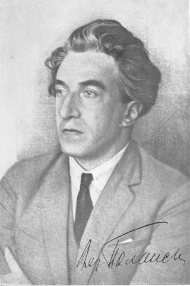

# Viacheslav Pavlovich Polonsky (Gusin)
## (1886-1932)

Welcome to the V. P. Polonsky website. Our goal is to illustrate the life and works of this remarkable Marxist scholar,
editor and literary critic. As one of the most active participants in the intellectual life and literary debates of the
1920s, Polonsky left behind a rich heritage which includes several volumes devoted to the biography of Bakunin. He
turned the journal «Новый мир» [New World] into one of the finest literary journals of his day. In addition, he left
many studies of the writers of the early Soviet era.  

New material is being added to the web site as it becomes available. Corrections, contributions and suggestions are welcome.