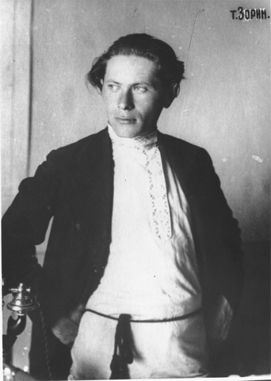

# Sergey Semenovich Zorin (Gombarg)
## (1890-1937)

Welcome to the Sergei. S. Zorin website. Our goal is to illustrate the life and works of this once prominent but now almost unknown Bolshevik.
Returning to Russia from the United States in 1917, where he had worked for years in the Socialist Party, Zorin actively participated in the
revolutionary events in Petrograd. He soon became Zinoviev's close assistant in the Comintern when it was founded in March 1919.
In 1923 he became party secretary in Ivanovo-Voznesensk. Later he became a member of the United Opposition in 1926.
Sharing the fate of many oppositionists, he was shot in 1937.

New material is being added to the web site as it becomes available. Corrections, contributions and suggestions are welcome.
